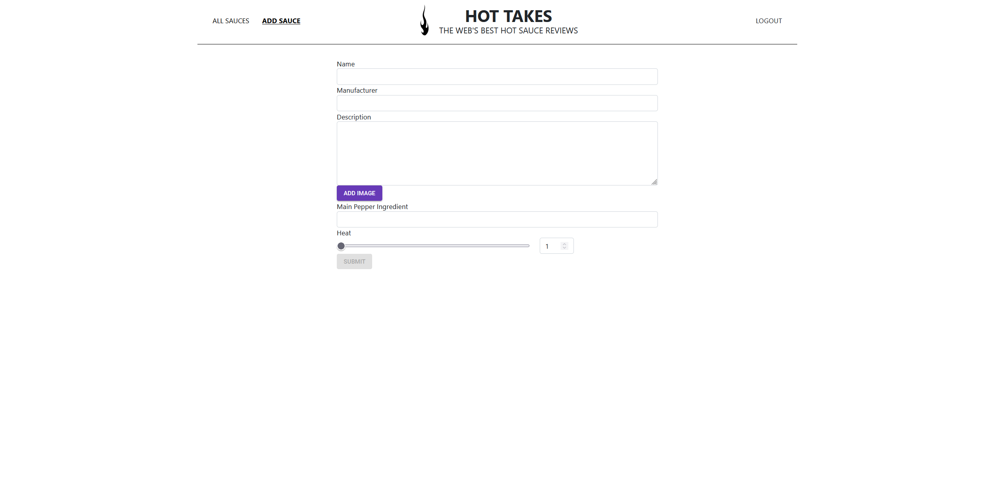

# Piiquante

languages : Js | Node.js

description : Dévelopement d'une API pour une application d'avis gastronomiques "Piiquante"
  
- Mettre en œuvre des opérations CRUD de manière sécurisée
- Implémenter un modèle logique de données conformément à la réglementation
- Stocker des données de manière sécurisée

